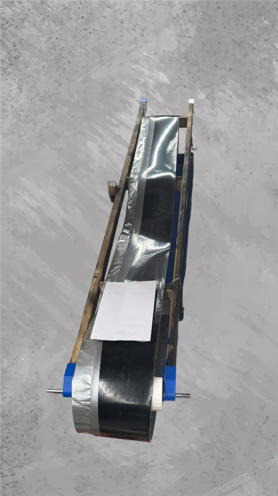
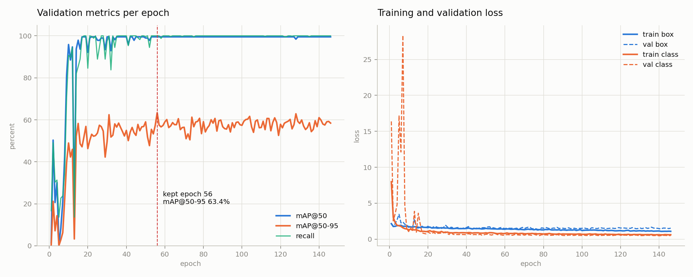

<div align="center">

# Mail Sorting Machine

**A conveyor carries an envelope past a camera, reads the destination off it, and
drops it into one of six bins. YOLO finds the address block, EasyOCR reads the
crop, a three-stage matcher turns that text into a Texas city, and a stepper
rotates the bin to the matching slot.**

[](LICENSE)
[](docs/BOM.md)
[](requirements.txt)
[](#results)
[](tests/test_address_verify.py)
[](CONTRIBUTING.md)

[Quick start](#quick-start) · [Results](#results) · [How it works](#how-it-works) ·
[The build](#the-build) · [Guide](docs/GUIDE.md) · [Contributing](CONTRIBUTING.md)

</div>



---

## At a glance

| | |
|---|---|
| **Compute** | An NVIDIA Jetson AGX Orin. The vision stage needs GPU memory for two models more than it needs clock speed, and the AGX part has headroom the 8 GB Orin Nano does not. |
| **Routes** | Houston, San Antonio, Dallas, Austin, Lubbock, and `unknown`. The sixth slot is a destination, not an error path: anything the matcher will not commit to goes there instead of into a wrong city. |
| **Detection** | A trained YOLO detector, two classes, receiver and sender. It found the address block on 20 of 20 rendered envelopes across five capture conditions. |
| **Reading** | EasyOCR on the detector's crop, rotation carried through so the boxes and the image agree. |
| **Matching** | Three stages: exact ZIP, exact city, then fuzzy. `FUZZY_MIN_SCORE` = 0.80 is the floor that separates genuine misspellings from garbled OCR. |
| **Actuation** | A stepper rotates the bin carousel, and an AS5600 magnetic encoder on the bin shaft closes the loop on where the bin actually stopped. |
| **Result** | 0 misroutes in 20. Four capture conditions routed 100% correctly; the fifth failed at OCR and rejected all four of its envelopes to `unknown`. |

---

## Quick start

Nothing but Python and `rapidfuzz` is needed for the first three:

```bash
pip install -r requirements.txt
```

```bash
python tests/test_address_verify.py                          # 13 tests, no GPU needed
python tools/check_bin_maps.py                               # the two bin tables agree
python src/address/validate_tx_zip_city.py data/tx_zip_city.csv
```

These two load `best-weights.pt` and, in the bench, EasyOCR. They write the
figures under `figures/`:

```bash
python tools/evaluate_detector.py
python tools/pipeline_bench.py --per-condition 4
```

This one needs only the checkpoint. It reads the training record out of
`best-weights.pt` and writes the model card and the training curves:

```bash
python tools/model_provenance.py
```

On the hardware:

```bash
python3 src/hardware/rotbin_encoder.py Houston   # bin only
python3 src/run_sorter.py                        # conveyor + breakbeam
python3 src/vision/receiver_pipeline.py --weights best-weights.pt --source 0
```

---

## Results

**Every good capture routed correctly, and nothing was misrouted.** Over 20
rendered envelopes across five capture conditions, the detector found the address
block on all 20. The clean, blurred, motion-degraded and dim conditions routed
100% correctly, all of them resolved by ZIP code. The worst condition failed at
the OCR stage and all four of its envelopes went to the `unknown` bin. Misroutes:
0 of 20.


**A confidence floor turned the one misroute into a reject.** Replaying the same
run's OCR text with `FUZZY_MIN_SCORE` set to 0 sends one San Antonio envelope to
the Dallas bin on a fuzzy score of 0.545. Garbled OCR from the worst captures
scores 0.500 to 0.727; genuine misspellings score 0.857 to 1.000. The floor sits
at 0.80, inside that gap.

**The detector is good at the job it has and bad by the metric a paper would
report.** Scored against ground-truth boxes over 30 envelopes, containment is
1.000 in four conditions and 0.986 mean, 0.944 worst-case in the fifth. Mean IoU
is 0.367 to 0.416, and precision and recall are both zero at any IoU threshold of
0.45 or above. Containment is the metric that decides whether OCR gets the
address, and the full argument is in the guide.


| condition | detected | routed correctly | rejected | mean containment | mean IoU |
| --- | ---: | ---: | ---: | ---: | ---: |
| clean | 4/4 | 4/4 | 0/4 | 1.000 | 0.398 |
| slight_blur | 4/4 | 4/4 | 0/4 | 1.000 | 0.416 |
| motion | 4/4 | 4/4 | 0/4 | 1.000 | 0.394 |
| dim | 4/4 | 4/4 | 0/4 | 1.000 | 0.383 |
| bad | 4/4 | 0/4 | 4/4 | 0.986 | 0.367 |

*Four conditions route every envelope correctly. The fifth degrades OCR past
recovery and all four of its envelopes reject to `unknown` rather than guess.
Containment stays at or near 1.000 throughout, which is what decides whether OCR
receives the whole address.*


*The same detector scored the way a paper would. Precision and recall fall to
zero at any IoU threshold of 0.45 or above, because the boxes are padded and
bracket the block rather than hugging the glyphs. Nothing about the routing
changes; the metric measures a different thing.*


*Median per envelope: 10.8 ms of YOLO, 102.9 ms of EasyOCR, 0.040 ms of address
matching, 113.5 ms in total. Reading the crop costs roughly ten times what
finding it does, and the matcher is free by comparison. Repeat runs land between
107 and 123 ms.*

**The model documents its own training.** Ultralytics stores the whole run inside
the checkpoint, so the hyperparameters, the per-epoch validation history and the
epoch that was kept all survive in `best-weights.pt` itself. The detector is
YOLO11s, 9,428,566 parameters, started from `yolo11s.pt` and trained at image
size 1024 with batch 10 against a 300-epoch budget. Early stopping ended it at
epoch 146 and kept epoch 56, whose validation numbers are precision 98.73%,
recall 100%, mAP@50 99.50% and mAP@50-95 63.37%. Those are the trainer's numbers
on its own split and are not the same measurement as the containment and IoU
above; [docs/MODEL_CARD.md](docs/MODEL_CARD.md) explains the difference.



---

## How it works


The matcher is ordered cheapest-first and most-certain-first. A ZIP is five
digits with a single correct answer, so it never reaches the fuzzy stage; the
fuzzy stage only ever sees text the first two could not resolve, which is what
makes a single floor value work across all five capture conditions.

That is the machine's data path, and it runs as two programs rather than one.
`src/vision/receiver_pipeline.py` covers camera to city name;
`src/run_sorter.py` covers breakbeam, conveyor and bin, and takes the
destination from the keyboard. Each half was brought up and proven on its own,
and the seam between them was never closed into a single process.

---

## The build

| | |
|---|---|
|  |  |
| The belt deck: two wooden trestles, a plank frame and the belt running between end rollers. The white funnel at the near end is the drop chute. | The plywood cabinet the belt deck sits in, with the six-partition bin drum on the bench behind it. |
|  |  |
| The printed mount that carries the IR photogate over the belt. Breaking that beam is what stops the conveyor, so the envelope is stationary before a frame is taken. | The bin drive: a NEMA 17 in a printed mount, coupled to the shaft that carries the partitioned plate above it. The AS5600 on that shaft is what turns an open-loop stepper move into a confirmed position. |
|  |  |
| Every mechanical part on the machine was printed rather than bought: rollers, end brackets, the photogate mount, the bin plate. This is a drive roller on the printer bed with its brim still attached. | The same roller offered up to the frame rails. The blue end brackets clamp to the rails, so belt tension is set by where the brackets sit rather than by an idler. |

---

## Layout

```text
src/
  config.py                  pin map, bin angles, tuning values
  run_sorter.py              conveyor + breakbeam + manual routing loop
  hardware/                  breakbeam, conveyor, AS5600, rotating bin
    rotbin_encoder.py        standalone bin controller, the one used on the rig
  vision/                    yolo_receiver, ocr_reader, receiver_pipeline
  address/                   address_verify, validate_tx_zip_city
tools/                       pipeline_bench, evaluate_detector, check_bin_maps,
                             model_provenance
tests/                       address matcher behaviour + misroute regression
data/                        address list, ZIP/city tables, annotation scaffold
figures/                     sorting outcome and stage latency from pipeline_bench,
                             detector figures from evaluate_detector
docs/                        GUIDE.md, MODEL_CARD.md, BOM.md, build photographs
best-weights.pt              the detector every tool here loads,
                             classes {0: receiver, 1: sender}
```

---

## Documentation

**[docs/GUIDE.md](docs/GUIDE.md)** is the design and test report: the
architecture, the parts and why they were chosen, how each number was measured,
every figure with a caption, what the automated checks cover, and the limits.
Parts and prices are in [docs/BOM.md](docs/BOM.md).

**[docs/MODEL_CARD.md](docs/MODEL_CARD.md)** is the detector's provenance, read
out of the checkpoint rather than written from memory: architecture, classes,
every hyperparameter that shaped the run, the per-epoch history and the epoch
that shipped.

One thing to know before reading further: the annotation scaffold in `data/yolo/`
is a one-class CVAT job, and `best-weights.pt` is a two-class model. The training
images are not in this repository and the run was a hosted one, so the detector
cannot be retrained from what is here. It can be documented, which the model card
does, and evaluated, which `tools/evaluate_detector.py` does.

## Contributing

Pull requests are welcome. [CONTRIBUTING.md](CONTRIBUTING.md) lists the checks to
run before opening one.

## Licence

MIT. See [LICENSE](LICENSE). The checkpoint in `best-weights.pt` was produced
with Ultralytics and carries an AGPL-3.0 marker of its own; the MIT grant covers
the code in this repository.
