# Mail sorter: design and test report

This is the working document for the machine described in
[../README.md](../README.md). It covers what the sorter has to do, how it is
built, how each number in the repository was obtained, and where the design is
still unproven. Numbers here were produced by the tools in `tools/` on the
machine listed under [Environment](#environment); every one of them has a command
next to it in [Reproducing every number](#reproducing-every-number).

## Contents

- [The problem](#the-problem)
- [Architecture](#architecture)
- [The machine](#the-machine)
- [Reading an envelope](#reading-an-envelope)
- [Turning text into a city](#turning-text-into-a-city)
- [Method](#method)
- [How well the detector localises](#how-well-the-detector-localises)
- [End to end](#end-to-end)
- [The confidence floor](#the-confidence-floor)
- [The address table on its own](#the-address-table-on-its-own)
- [What is checked automatically](#what-is-checked-automatically)
- [Limits](#limits)
- [Reproducing every number](#reproducing-every-number)
- [Environment](#environment)

## The problem

Sort mail by destination city without a human reading each piece. An envelope
arrives on a belt, something has to find the delivery address on it, read it,
decide which of a fixed number of bins it belongs in, and physically put it
there.

Six bins is the number the mechanism supports, and that constraint drives most of
what follows. Five of the slots are cities the machine will deliver to: Houston,
San Antonio, Dallas, Austin and Lubbock. The sixth is `unknown`.

Four requirements came out of that framing, and the code is organised around
them.

**A wrong city costs more than a reject.** A rejected piece costs one manual
re-run at the same bench. A misrouted piece goes on a truck to another city and
comes back days later, if it comes back. Every ambiguous case therefore has to
resolve toward `unknown`, and the matcher has to be able to refuse.

**The address has to survive a bad capture.** The camera looks down at a moving
belt under whatever light the room has. Blur, rotation, JPEG artefacts and low
brightness are the normal case, not the failure case, so the vision stage is
measured against degraded input rather than clean input.

**The bin has to know where it is.** Open-loop stepping accumulates error, and a
plate that lands between two slots drops the envelope in the wrong place or
jams. The shaft carries an absolute magnetic encoder and every move is closed
against it.

**Every move has to terminate.** A closed loop that trusts its sensor will spin
forever when the sensor stops telling the truth. That failure was seen on the
bench and the bounds described below were added because of it.

## Architecture

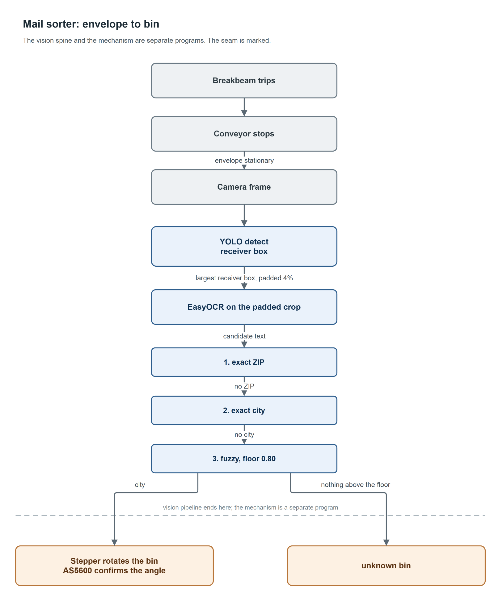

The six slots sit 60 degrees apart on one plate:

| slot | angle | | slot | angle |
| --- | ---: | --- | --- | ---: |
| lubbock | 0° | | austin | 180° |
| san antonio | 60° | | dallas | 240° |
| houston | 120° | | unknown | 300° |

Those angles are written down twice on purpose. `src/config.py` holds
`BIN_SLOTS` for the modular scripts, and `src/hardware/rotbin_encoder.py` holds
`CITY_TO_ANGLE` so that one file can be copied to the board and run with nothing
to import. Two copies of a table drift, so `tools/check_bin_maps.py` parses the
standalone file as text and fails if the two disagree on any slot.

The pieces run separately by design. `src/run_sorter.py` drives the conveyor,
watches the breakbeam and takes the destination from the keyboard;
`src/vision/receiver_pipeline.py` drives the camera, detector, OCR and matcher
with no motors attached. The camera side and the motor side fail in unrelated
ways, and debugging them as one program wasted bench time.

## The machine

Parts and prices are in [BOM.md](BOM.md); purchased total was $71, with the
steppers, drivers, belt and buck converter already on hand. The parts that shaped
the design:

| Part | Why it is this part |
| --- | --- |
| NVIDIA Jetson AGX Orin | The vision stage holds a YOLO detector and an EasyOCR recognizer in GPU memory at the same time. That makes memory, not clock rate, the binding constraint, and it is what rules out the 8 GB Orin Nano. The 40-pin header carries the I2C bus the encoder sits on and the GPIO the drivers are stepped from, so one board does perception and actuation. |
| Autofocus camera module | Fixed-focus modules smear the address block at conveyor working distance. |
| IR reflective photogate | Trips when an envelope reaches the capture spot. The frame grab is gated on it rather than on a timer, so belt speed does not have to be stable. |
| NEMA 17 plus DRV8825, twice | One for the belt, one for the bin plate. Same driver on both keeps the wiring and the step timing identical. |
| AS5600 magnetic encoder | Absolute angle over I2C. See the substitution note below. |
| Diametric disc magnet, 8 mm x 3 mm | Sits on the bin shaft under the sensor die. Both the specified encoder and the fitted one want the same magnet. |

The BOM specifies an **AS5048A**, a 14-bit SPI encoder on an adapter board. The
machine that was built runs an **AS5600**, 12 bits over I2C, and the hardware
layer reads the way it does because of that: `src/hardware/as5600_encoder.py` and
`rotbin_encoder.py` open I2C bus 1, there is no chip-select anywhere, and angle
comes back as a 12-bit count, 4096 per revolution, about 0.088° per count. Slots
are 60° apart, so resolution was never the binding constraint; stepper overshoot
was. The I2C part also avoided freeing SPI pins on a crowded header.

| | |
| --- | --- |
| 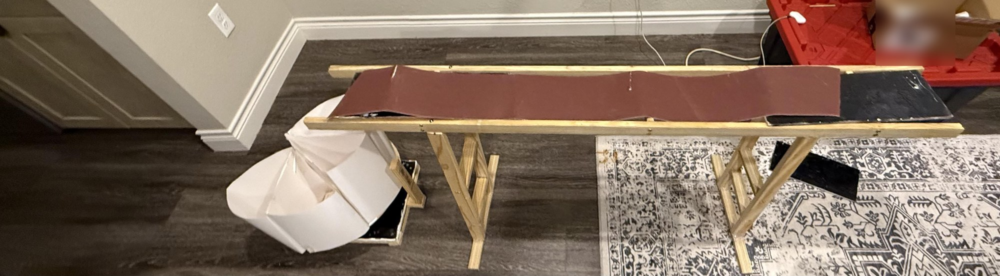 | 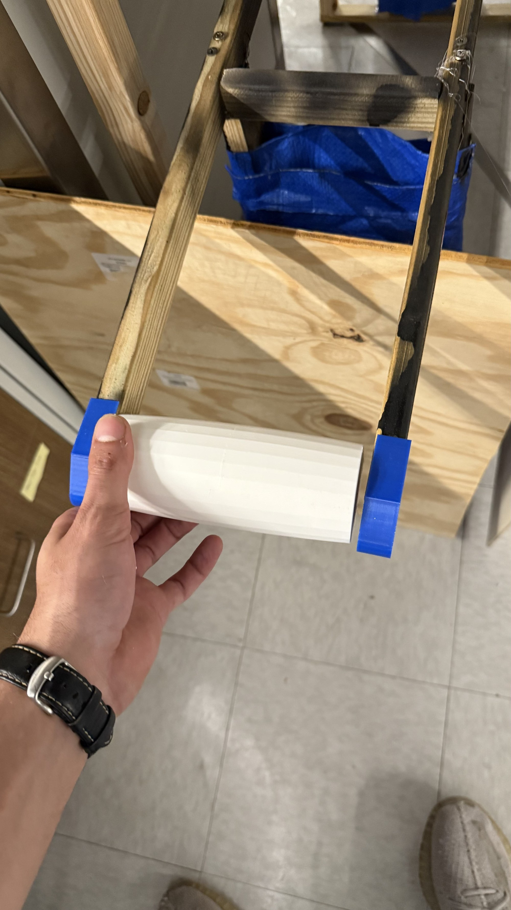 |
| The belt deck: two wooden trestles, a plank frame and the belt running between end rollers. The white funnel at the near end is the drop chute. | A printed roller before it went into the blue end brackets clamped to the frame rails. |
| 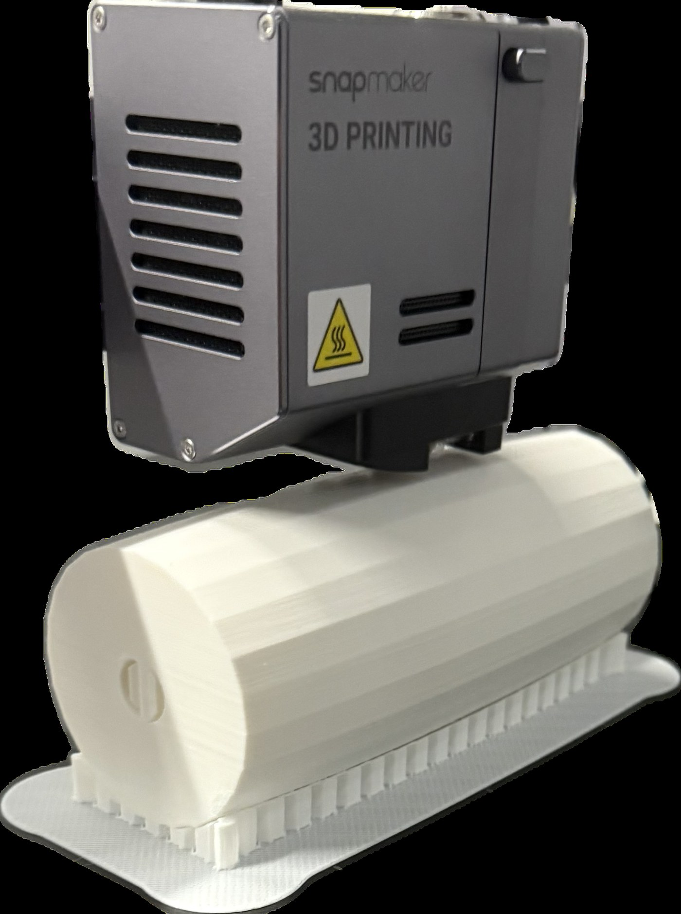 | |
| The same roller coming off the printer. Rollers, end brackets, photogate mount and bin plate were all printed, which is why the BOM's purchased total is $71: the mechanism is filament and the money went on the camera, the encoder and the steppers. | |
| 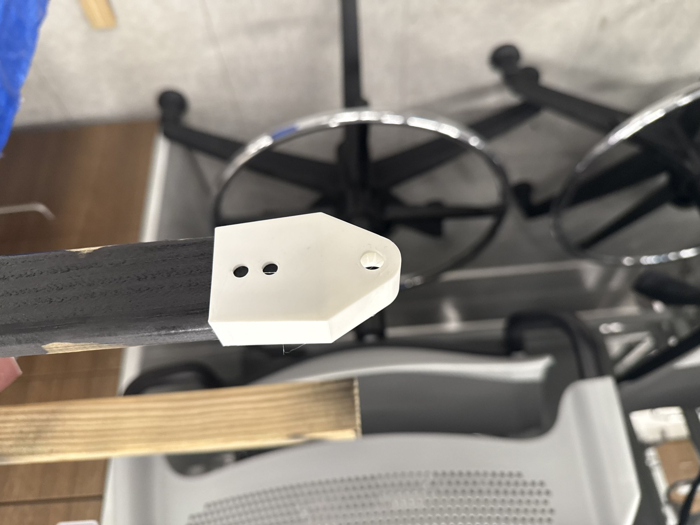 | 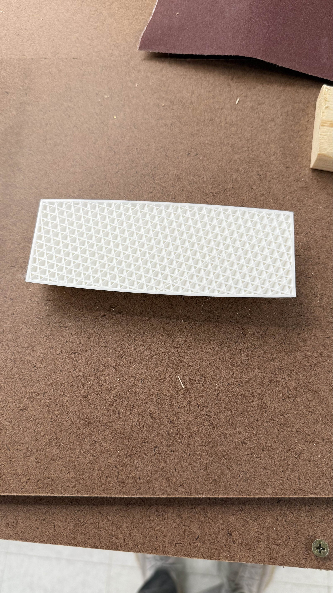 |
| The printed mount that carries the IR photogate over the belt. The two small holes take the emitter and receiver pair. | The retroreflective strip the photogate aims at from across the deck. |
| 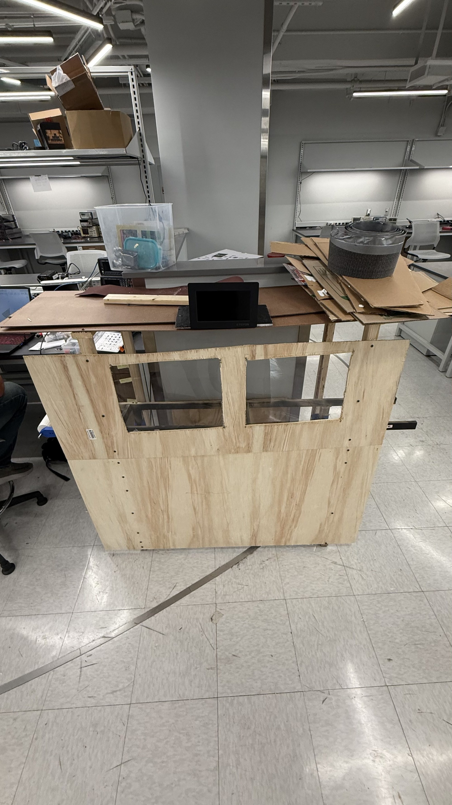 | 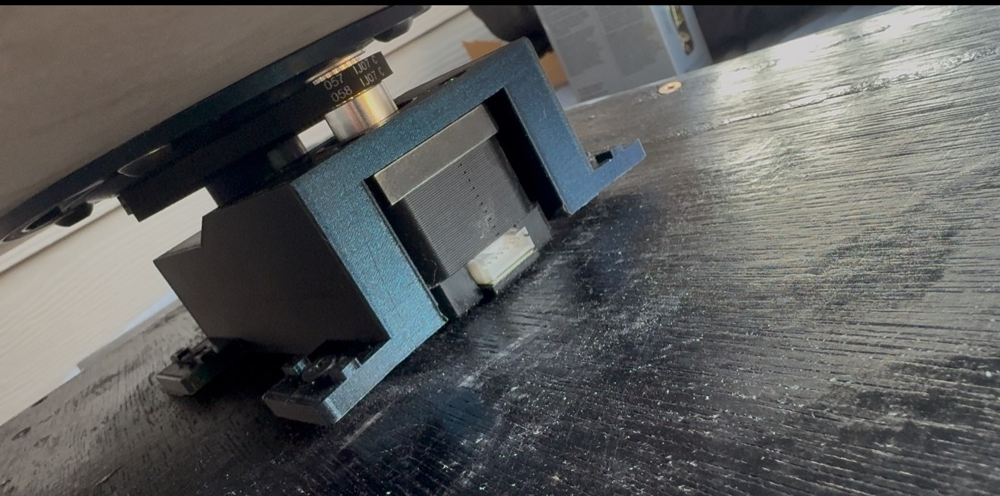 |
| The plywood cabinet the belt deck sits in, with the six-partition bin drum on the bench behind it. | The bin drive: a NEMA 17 in a printed mount, coupled to the shaft that carries the partitioned plate above it. |

### Getting the plate to stop in the right place

Two controllers exist for the bin and they differ in how they slow down.
`src/hardware/rotating_bin.py` is the modular one used by `run_sorter.py`;
`rotbin_encoder.py` is the standalone file that ran on the rig.

The standalone controller runs three speeds against distance to target: cruise at
0.5 ms per half-pulse, an approach band inside 10°, and a creep band inside 2° at
2 ms per half-pulse. It also stops 5° short of the commanded angle
(`LEAD_DEG`) and waits `PAUSE_S = 5.0` seconds before returning. Early runs
overshot and landed between slots; slowing on approach is what fixed it.

The modular controller adds bounds that do not depend on the encoder being
honest. `move_to_abs_deg()` gives up on three separate conditions: measured
travel past 1085°, 20000 step pulses, or 30 seconds of wall clock. Travel alone
is not enough, because it only grows when the encoder reports motion. A disabled
driver, a slipped belt and a magnet knocked off the shaft all present as an angle
that never changes, and the loop pulsed forever on all three. Step count and the
deadline are measured on the near side of the encoder and stop it.

Calibration is written to disk, so the bin does not need re-zeroing at every
start. Importing either hardware module is safe on a laptop: the I2C bus, the
GPIO claims and the 25-pulse direction sweep all live inside `setup_hardware()`,
which only `__main__` calls.

## Reading an envelope

`best-weights.pt` is a YOLO11s detection model with 9,428,566 parameters and two
classes, `{0: receiver, 1: sender}`. Ultralytics writes the whole training record
into the weights file, so how this model was made survives even though the images
do not: [MODEL_CARD.md](MODEL_CARD.md) is that record, extracted by
`python tools/model_provenance.py` and not retyped. The short version is 300
epochs budgeted from `yolo11s.pt` at image size 1024 with batch 10, stopped by
early stopping at epoch 146, with epoch 56 kept. At inference
`ReceiverDetector` runs at image size 960 with a confidence threshold of 0.25,
keeps only boxes of the `receiver` class, takes the largest surviving box, and
pads the crop by 4% of its longer side before handing it to OCR. If the model
carries segmentation masks it prefers the mask extent; these weights do not, so
the box path is what runs.

OCR is EasyOCR on the padded crop, after `preprocess_roi()` autocontrasts,
applies an unsharp mask and upscales by 1.8x for crops under 720 px. EasyOCR
returns a list of lines; the reader also joins them into one string and scores
every candidate, favouring text that contains a five-digit group or a
`City, ST` pattern. The matcher gets the whole candidate list, not just the
winner.

The annotation scaffold in `data/yolo/` is a separate thing and it does not match
those weights.

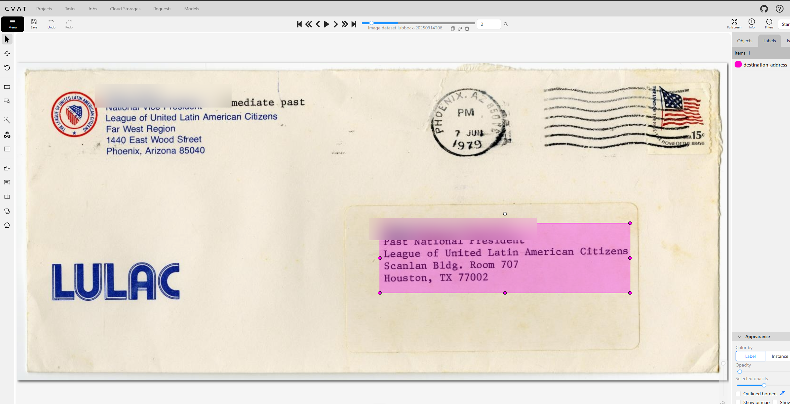

*One of the 25 hand-annotated images: a single `destination_address` box around
the delivery block, with the return address in the top left deliberately outside
it. The label list on the right has exactly one entry. `best-weights.pt` is a
two-class model, so this job did not produce it. The run that did was a hosted
one, which is why its images are not on any machine here; its settings and its
per-epoch history are in [MODEL_CARD.md](MODEL_CARD.md). The recipient names on
this archival envelope are blurred.*

`data/yolo/train.txt` lists 25 image paths under `data/images/train/`. The JPGs
themselves are not committed. You cannot retrain the shipped weights from what is
here. You can evaluate them, and that is what `tools/evaluate_detector.py` exists
to do.

## Turning text into a city

`src/address/address_verify.py` tries three things in order and stops at the
first that answers.

1. **ZIP lookup**, confidence 0.97. Pull five-digit groups out of the text, match
   the exact code first, then the three-digit prefix.
2. **City and state line**, confidence 0.80. Regex for `SOMETHING, TX`, accepted
   only if it names one of the five routable cities.
3. **Fuzzy match**, capped at 0.75. Score every word and every adjacent word pair
   against the city names and a hand-written misspelling table.

Two details in that stack are load-bearing.

The ZIP parser expects OCR damage and repairs it before matching: `O` becomes
`0`, `I` and `l` become `1`, and an `S` between two digits becomes `5`. Those are
the substitutions EasyOCR actually made on this data, and `parse_zip5s_loose()`
is tested against all three.

The fuzzy stage scores whole strings with `rapidfuzz.fuzz.ratio`, and the choice
of scorer is not cosmetic. `fuzz.WRatio` falls back to a partial ratio when two
strings differ in length, which scores the bare token `san` at 0.90 against
`san antonio`. Every San Francisco and San Diego envelope went to the San Antonio
bin at 0.75 confidence. `fuzz.ratio` scores that same pairing 0.429 while still
scoring `houstqn` against `houston` at 0.857. Adjacent word pairs are generated
precisely because whole-string similarity cannot otherwise match a two-word city:
`antonio` alone against `san antonio` is a length mismatch and scores badly.

Below `FUZZY_MIN_SCORE = 0.80` the stage refuses to answer and the piece goes to
`unknown`. Where that number comes from is [its own section](#the-confidence-floor).

## Method

Two harnesses, two samples, one renderer.

The renderer lives in `tools/pipeline_bench.py`. It draws a 1000 x 620 envelope
with a return block top left, a postage box top right and the receiver block
centre right, then degrades it the way a conveyor camera would:

| condition | blur px | noise sigma | rotation | JPEG quality | brightness |
| --- | ---: | ---: | ---: | ---: | ---: |
| clean | 0.0 | 0 | 0° | 95 | 1.00 |
| slight_blur | 1.0 | 3 | ±1.5° | 85 | 1.00 |
| motion | 2.0 | 6 | ±3.0° | 70 | 0.92 |
| dim | 1.5 | 10 | ±2.0° | 60 | 0.72 |
| bad | 3.0 | 16 | ±5.0° | 45 | 0.65 |

The envelope images are the one synthetic part, and they are the input medium
only. Detection is the committed weights, OCR is EasyOCR, matching is the shipped
module. Nothing is stubbed.

Ground truth for the detector comes free from the renderer. It draws the receiver
block a second time into a single-channel mask, rotates the mask by the same
angle with nearest-neighbour resampling, and takes `getbbox()` of the result. The
true box is therefore the tight glyph extent after rotation, computed rather than
estimated by eye.

The two harnesses take separate samples with separate seeds, and neither reuses
the other's images:

| tool | seed | per condition | total | what it reports |
| --- | ---: | ---: | ---: | --- |
| `tools/pipeline_bench.py` | 7 | 4 | 20 | routing outcome, per-stage latency |
| `tools/evaluate_detector.py` | 11 | 6 | 30 | containment, IoU, precision and recall, confidence |

`--per-condition 4` is not an arbitrary default. It cycles the first four
destinations only, so the pipeline tables cover four of the five routable cities;
Lubbock appears from `--per-condition 5` upward. More to the point, the fixtures
under `tests/fixtures/envelopes/` and the OCR strings pinned in
`tests/test_address_verify.py` come from that exact run. Change the value and the
fixtures re-render, the OCR output changes with them, and the pinned strings stop
matching.

The bench burns one untimed warm-up pass before the timed loop. The first
inference of a process pays model load and CUDA context setup; even with the
warm-up in place the largest single detect time in the recorded run is 35.4 ms
against a median of 10.8 ms, and folding a cold pass into a 20-envelope aggregate
would move the aggregate.

## How well the detector localises

Two numbers are reported because they answer different questions. **Containment**
is the fraction of the true address block that lands inside the predicted crop,
and it decides whether OCR gets the whole address. **IoU** additionally charges
the crop for being larger than the text.

Over 30 envelopes, 6 per condition:

| condition | found | mean containment | min containment | mean IoU | min IoU | mean conf |
| --- | ---: | ---: | ---: | ---: | ---: | ---: |
| clean | 100% | 1.000 | 1.000 | 0.398 | 0.386 | 0.703 |
| slight_blur | 100% | 1.000 | 1.000 | 0.416 | 0.392 | 0.705 |
| motion | 100% | 1.000 | 1.000 | 0.394 | 0.391 | 0.665 |
| dim | 100% | 1.000 | 1.000 | 0.383 | 0.363 | 0.664 |
| bad | 100% | 0.986 | 0.944 | 0.367 | 0.321 | 0.544 |

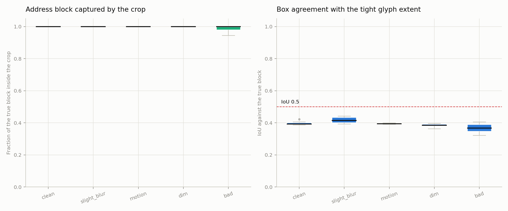

*Containment on the left sits on 1.000 for the first four conditions and only
drops in the worst, where the lowest single envelope keeps 94.4% of the address
block. IoU on the right never approaches the dashed 0.5 line in any condition.
The two panels are the same 30 detections measured two ways.*

By the metric an object detection paper would report, this detector is poor:

| IoU threshold | 0.30 | 0.35 | 0.40 | 0.45 and up |
| --- | ---: | ---: | ---: | ---: |
| precision | 1.00 | 0.93 | 0.23 | 0.00 |
| recall | 1.00 | 0.93 | 0.23 | 0.00 |

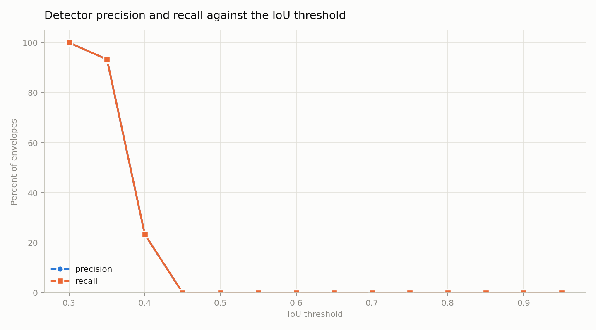

*Both curves fall off a cliff between 0.35 and 0.45 and are flat at zero above
it. Precision and recall are identical here because every one of the 30
envelopes contains exactly one address block and the detector returned exactly
one box for each, so a miss at threshold costs both equally.*

The reason is visible rather than theoretical. The weights were trained on padded
annotations, so the model brackets the address block instead of hugging the
glyphs, and IoU charges it for every pixel of margin.

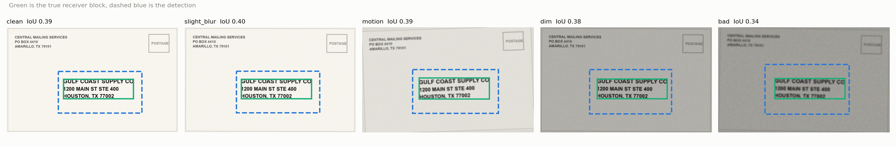

*One detection per condition, first envelope of each, all Houston. The dashed
blue box sits outside the green ground truth on every side in every condition.
That margin is the entire IoU deficit, and it is also why containment is 1.000:
the address is inside the crop with room to spare. Example IoUs run 0.39, 0.40,
0.39, 0.38, 0.34 from clean to bad.*

That is an argument for this pipeline, not a general defence. What the pipeline
needs is the whole address inside the crop handed to OCR, and containment
measures that directly. Anything that cares about box geometry rather than
feeding an OCR crop should read the IoU column, and the IoU column is bad.

One more caution. The checkpoint carries its own training-time validation
metrics: precision 0.987, recall 1.000, mAP50 0.995, mAP50-95 0.634. Those were
measured on a held-out split that is not in this repository, against annotations
drawn the same padded way as the training set, so they cannot be checked here and
they do not contradict the table above. They are reported by the file, not by
this work.

## End to end

`tools/pipeline_bench.py --per-condition 4` runs the shipped code on 20 rendered
envelopes.

| capture condition | address block found | routed correctly | to unknown bin | misrouted |
| --- | ---: | ---: | ---: | ---: |
| clean | 100% | 100% | 0% | 0% |
| slight blur | 100% | 100% | 0% | 0% |
| motion | 100% | 100% | 0% | 0% |
| dim | 100% | 100% | 0% | 0% |
| bad | 100% | 0% | 100% | 0% |

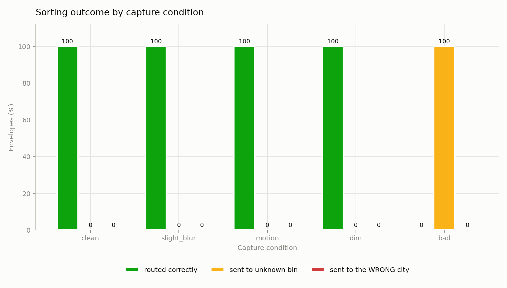

*Four conditions are entirely green and the fifth is entirely amber. The red
series, envelopes sent to the wrong city, is zero everywhere and therefore
invisible, which is the point of the chart.*

Every one of the 16 correctly routed envelopes resolved through the ZIP stage,
not the city line and not the fuzzy stage. Detection is not what fails first;
reading is. All four `bad` envelopes were found by the detector and then produced
OCR text with no recoverable ZIP and no recognisable city, so they rejected.

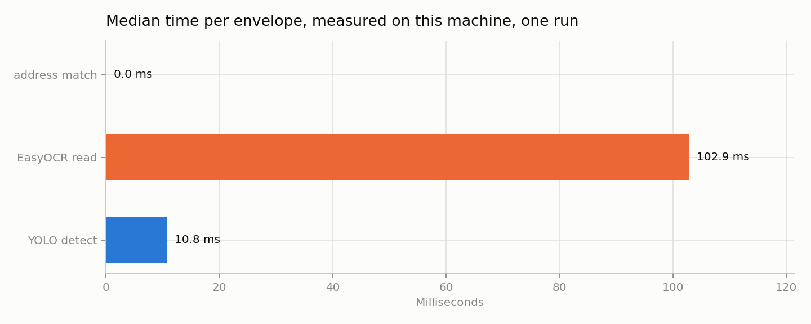

*Median per envelope over the 20-envelope run behind the committed figure: 10.8
ms of YOLO, 102.9 ms of EasyOCR, 0.040 ms of address matching, 113.5 ms in total,
8.8 envelopes per second. Reading the crop costs roughly ten times what finding
it does, and the matcher is free by comparison.*

Any single timing figure here moves. Seven runs of the same command on the same
GPU gave per-envelope medians of 116.0, 119.8, 118.5, 123.4, 120.5, 106.8 and
113.5 ms, in that order. Quote the range: **107 to 123 ms, 8.1 to 9.4 envelopes
per second**. The committed figure is the last of those runs, and the chart plots
medians, so the figure and this paragraph cannot drift apart.

**Only the timings move.** Re-running the bench and diffing its output against the
previous run's `pipeline_results.json` gives zero differences in every
non-timing field across all 20 envelopes: the same detections, the same verbatim
OCR strings, the same city, the same method, 16 correct, 4 rejected, 0 misrouted.
The renderer is seeded and inference is deterministic, so the routing result is
reproducible even though the clock is not.

**This is vision-stage throughput on a desktop GPU, not machine throughput.** It
is the time from an in-memory frame to a city name, on an RTX 4060. It says
nothing about how fast the sorter moves mail. Belt speed, the delay from
breakbeam trip to capture and bin rotation time were never instrumented, and the
bin is far slower than the vision stage: `rotbin_encoder.py` sits on a hard-coded
five-second dwell after every move, before any stepping time at all. Pieces per
minute for the machine as built is not a number this repository can give you.

## The confidence floor

Before the floor existed, the fuzzy stage answered with whatever it scored best.
Replaying the recorded run's OCR text with `FUZZY_MIN_SCORE` set to 0 gives 19
correct, 0 rejects and **1 misroute out of 20**: a San Antonio envelope whose OCR
came back as

```
AlAMO aaty Olot M iaoemooar Aaaana toren
```

scored `Dallas` at 0.545 and went to the Dallas bin. With the floor in place the
same run gives 16 correct, 4 rejects and **0 misroutes**. The trade is deliberate
and it is the first requirement in this document: three correctly-read-by-luck
envelopes become manual re-runs so that one envelope stops boarding a truck to
Dallas.

The scores separate cleanly once you look at them.

| input | best fuzzy score |
| --- | ---: |
| the four verbatim `bad`-condition OCR strings from that run | 0.500, 0.545, 0.714, 0.727 |
| genuine misspellings (`HOUSTQN`, `AUSTN`, `SAN ANTONIQ`, `HOUSTONN`, `DALAS`, `aust1n`) | 0.857 to 1.000 |

`FUZZY_MIN_SCORE = 0.80` sits in that gap with room on both sides. Two of the
four garbled strings are pinned verbatim in `tests/test_address_verify.py` as a
regression, alongside the six misspellings, so the floor cannot be raised or
lowered without a test failing.

The floor is not the only thing holding the gap open. The `fuzz.ratio` choice
described earlier does the other half of the work, and the San Francisco, San
Diego and San Jose cases are pinned as tests too: they score 0.667, 0.600 and
0.526 respectively and all three resolve to `unknown`.

## The address table on its own

`data/tx_addresses.csv` holds 240 invented delivery addresses, 40 in each of six
cities. Recipients are fictional business names; the source list carried no names
at all. Only five of those six cities are routable. The 40 **Fort Worth**
addresses are kept on purpose as negative cases: valid Texas mail this sorter
cannot deliver, which should land in `unknown`.

`data/tx_zip_city.csv` indexes only the five routable cities. It validates clean:
107 rows, 102 exact five-digit ZIPs plus one three-digit prefix per city, split
Houston 26, San Antonio 26, Dallas 22, Austin 21, Lubbock 12.
`data/tx_zip_city.example.csv` is a 30-row cut of the same table, 6 per city, and
it is what the tests and the bench load.

Running all 240 addresses through the matcher against the full table:
**200 of 200 routable addresses land on the right city**, every one of them
resolved by ZIP. Of the 40 Fort Worth pieces, 39 reject as they should. The
fortieth is worth the space:

```
904 Houston St Apt 7A
Fort Worth, TX 76102
```

`76102` is not in the table, so the ZIP stage abstains. The city-state stage sees
`Fort Worth, TX`, finds it is not routable and abstains too. The fuzzy stage then
sees the token `Houston` in the street line and routes the piece to Houston at
0.75 confidence. Fort Worth has a real Houston Street, and so do several other
Texas cities. The matcher scores tokens without caring which line they came from,
so a street named after a routable city beats a city line naming an unroutable
one. That is a genuine defect, not a rounding error, and it is the first thing to
fix before trusting the fuzzy stage on out-of-area mail.

## What is checked automatically

Three checks run without a camera, a GPU or the weights.

```bash
python tests/test_address_verify.py                          # 13 tests
python tools/check_bin_maps.py
python src/address/validate_tx_zip_city.py data/tx_zip_city.csv
```

`test_address_verify.py` covers ZIP parsing including the OCR letter-for-digit
repairs, each of the three resolution stages reaching an answer, the empty input
case, the claim that every allowed city has a bin slot and that a reject bin
exists, and the misroute regressions: the two garbled strings, the floor sitting
above the garbage band and below genuine misspellings, and the `san` prefix case.

The suite is not standard-library only. `rapidfuzz` backs the fuzzy stage, and
without it `fuzzy_city()` silently degrades to the hand-written `ALIASES` table
and scores 0.0 on anything not listed there. In that state 13 tests still run,
`test_the_floor_sits_below_genuine_misspellings` fails on four of its six
subtests, and everything else passes, which is the misleading part. The module
therefore exports `HAVE_RAPIDFUZZ` and the suite asserts it before any test runs,
so a missing dependency produces one clear message instead of a half-dead fuzzy
stage nobody notices.

`check_bin_maps.py` reads `CITY_TO_ANGLE` out of `rotbin_encoder.py` as text
rather than importing it, because importing pulls in `smbus2` and the GPIO stack,
which are absent off the board. It compares all six slots against
`config.BIN_SLOTS` and exits non-zero on any difference.

**What these prove:** the matcher behaves as described on text input, the two bin
tables agree, and the ZIP table is well formed with no duplicate keys and no
unroutable cities.

**What they do not prove:** nothing here touches the detector, EasyOCR, I2C, GPIO
or a stepper. No test asserts that the bin physically arrives at the commanded
angle, that the breakbeam trips at the right point on the belt, or that the
camera is in focus at working distance. The detector and pipeline tools are
measurement harnesses, not assertions: they print numbers and write figures, and
they will happily report a bad result as a successful run.

## Limits

Stated plainly, with no hedging.

- **The envelope images are rendered.** Every routing and localisation number in
  this document was measured on synthetic input. Real mail has handwriting,
  window envelopes, stamps over text, glare and folds, and none of that is
  represented.
- **The detector cannot be retrained from this repository.** The training images
  are absent and the one-class scaffold in `data/yolo/` does not match the
  two-class weights. The run itself is documented, in
  [MODEL_CARD.md](MODEL_CARD.md), from the record inside the checkpoint: what it
  started from, every hyperparameter that mattered, the per-epoch validation
  history and the epoch that was kept. That is enough to say what the model is
  and to reproduce its inference exactly. It is not enough to rebuild it.
- **Mean IoU is 0.367 to 0.416.** Precision and recall are zero at any IoU
  threshold of 0.45 or above. This detector is fit for feeding an OCR crop and
  nothing else.
- **Machine throughput is unmeasured.** Belt speed, breakbeam-to-capture latency
  and bin rotation time were never instrumented. The five-second dwell in
  `rotbin_encoder.py` alone bounds the machine well below the vision stage.
- **Bin landing accuracy is unmeasured.** The controller stops within
  `TARGET_MARGIN_DEG = 0.4` of its planned stop point as reported by the encoder,
  and slots are 60° apart, but no independent measurement of where the plate
  actually sits was taken.
- **Lubbock is not covered by the pipeline bench.** The default of four per
  condition cycles four destinations. Lubbock is exercised by the tests and by
  the 240-address sweep, not by the end-to-end run.
- **The fuzzy stage does not know which line a token came from**, which is how a
  Fort Worth address on Houston Street reaches the Houston bin.
- **`run_sorter.py` takes the destination from the keyboard.** The camera
  pipeline and the motor loop have never been closed into one program on the
  machine; each was proven on its own.
- **One GPU, one run of everything.** All timings are from a single desktop with
  an RTX 4060. Nothing was measured on the Jetson AGX Orin the sorter runs on,
  and the two have different memory bandwidth and different thermal limits, so
  these figures do not transfer to it.

## Reproducing every number

Every figure under `figures/` is regenerated by one of two commands, and both
overwrite in place.

```bash
python tools/pipeline_bench.py --per-condition 4   # sorting outcome, stage latency, pipeline_results.json
python tools/evaluate_detector.py                  # localisation, precision-recall, examples, detector_metrics.json
```

| claim | where it comes from |
| --- | --- |
| 13 tests pass | `python tests/test_address_verify.py` |
| six bin slots agree across both tables | `python tools/check_bin_maps.py` |
| 107 rows, 5 cities, no duplicates | `python src/address/validate_tx_zip_city.py data/tx_zip_city.csv` |
| 102 exact ZIPs plus 5 prefixes | count the `zip` and `zip_prefix` columns of `data/tx_zip_city.csv` |
| containment, IoU, confidence, precision and recall | `python tools/evaluate_detector.py`, also written to `figures/detector_metrics.json` |
| routing outcome per condition, 0 of 20 misrouted | `python tools/pipeline_bench.py --per-condition 4` |
| per-stage medians and the verbatim OCR strings | `figures/pipeline_results.json`, written by the same command |
| the 107 to 123 ms spread | run the bench several times and read the `median ms per envelope` line |
| 1 misroute of 20 with the floor removed | replay `figures/pipeline_results.json` through `verify_address()` with `FUZZY_MIN_SCORE` set to 0 |
| the 0.500 to 0.727 garbage band | `fuzzy_city()` on the four `bad`-condition `ocr_text` values in `figures/pipeline_results.json` |
| the 0.857 to 1.000 misspelling band | `fuzzy_city()` on the six strings in `test_the_floor_sits_below_genuine_misspellings` |
| `san` scoring 0.90 under WRatio and 0.429 under ratio | `rapidfuzz.fuzz.WRatio("san", "san antonio")` and `fuzz.ratio(...)` |
| 200 of 200 routable, 39 of 40 Fort Worth rejected | run every row of `data/tx_addresses.csv` through `verify_address()` against `data/tx_zip_city.csv` |
| model class names, parameter count and training arguments | `python tools/model_provenance.py`, which reads them out of the checkpoint and writes [MODEL_CARD.md](MODEL_CARD.md) and `figures/training_curves.png` |

## Environment

The numbers in this document were produced on Python 3.13.13 with torch
2.8.0+cu128, ultralytics 8.3.199, rapidfuzz 3.14.5 and opencv-python 4.12.0, on
an NVIDIA GeForce RTX 4060. Both vision tools fall back to CPU when CUDA is
absent; they will run, and every timing number will change.
